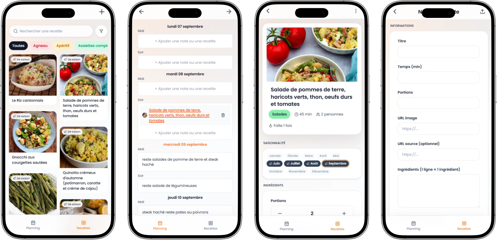

# 🍳 Meal Organizer

**Une PWA qui transforme n'importe quel lien de recette en fiche structurée, et organise le planning de repas de la semaine à partir d'une bibliothèque personnelle.**

Pensée à l'origine pour un usage personnel (à deux), l'app automatise ce qui prend habituellement du temps : copier une recette trouvée en ligne, la ranger, et décider quoi cuisiner chaque semaine.

🔗 **[Démo en ligne](https://meal-organizer-front-demo.vercel.app/)** — données fictives, sans authentification
📦 [Repo Backend](https://github.com/AntoineGallou31/meal-organizer-back)

<p align="center">
  
</p>

---

## ✨ Fonctionnalités

### 🍳 Recettes
- **Import automatique par URL** — colle un lien depuis n'importe quel site de recette, le backend scrape la page en priorisant le format structuré `schema.org` / JSON-LD, avec repli sur des heuristiques CSS et mots-clés en français si besoin. Titre, image, ingrédients, étapes et temps de préparation sont extraits automatiquement.
- **Détection de doublons** — refuse l'import si l'URL a déjà été utilisée.
- **Import partiel avec confirmation** — si des champs sont manquants, l'app propose de forcer l'import plutôt que d'échouer silencieusement.
- **Catégorisation automatique** par moteur de mots-clés (titre + ingrédients).
- **Détection de saisonnalité** — croise les ingrédients avec un calendrier français des produits de saison pour tagger les mois pertinents.
- **Scaler de portions** avec recalcul des quantités, gestion des fractions unicode (½ ⅓ ¼).
- Fiche recette détaillée, recettes similaires suggérées, compteur "cuisinée X fois", édition manuelle.

### 📋 Bibliothèque
- Grille en scroll infini, recherche texte, filtres (catégorie, ingrédient, mois/saison, temps de prépa max), tri multiple.
- Masquage automatique des recettes incomplètes.

### 🧠 Suggestions intelligentes
Feed généré à partir de la saisonnalité, de la popularité réelle (déduite de l'historique du planning), d'une pénalité de diversité pour éviter les répétitions de catégories, et d'exclusions (desserts/boissons/snacks, recettes déjà suggérées la semaine précédente).

### 📅 Planning hebdomadaire
- Vue calendrier déjeuner/dîner × 7 jours.
- Recette existante ou note libre par case, avec auto-complétion `@recette`.
- Historique utilisé pour calculer popularité et fréquence de cuisine.

### 📱 PWA
- Installable sur mobile et desktop.
- **Web Share Target** : partage un lien de recette depuis n'importe quelle app pour lancer l'import directement dans Meal Organizer.
- Cache des assets hors-ligne via Workbox.

### 🗂️ Catégories
CRUD complet avec couleur et mots-clés associés, catégorie par défaut protégée, compteur de recettes.

---

## 🛠️ Stack technique

**Frontend**
| | |
|---|---|
| Framework | React 19 + Vite |
| Style | Tailwind CSS 4 |
| Data fetching | TanStack React Query (cache, mutations, scroll infini) |
| Routing | React Router 7 |
| UI primitives | Radix UI |
| PWA | `vite-plugin-pwa` (Workbox, manifest, Web Share Target) |

**Backend**
| | |
|---|---|
| Runtime | Node.js + Express 5 |
| Base de données | Supabase (PostgreSQL + RPC pour la recherche par ingrédient) |
| Scraping | Axios + Cheerio, parsing `schema.org`/JSON-LD, repli sur heuristiques CSS |
| Déploiement | Serverless sur Vercel |

---

## 🏗️ Architecture

Le projet est séparé en deux repos, déployés indépendamment :

```
meal-organizer-front/   → React + Vite, déployé sur Vercel
meal-organizer-back/    → Express, fonctions serverless Vercel
```

La démo publique tourne sur le même code que ce repo, connectée à une instance Supabase séparée avec des données fictives — aucune donnée personnelle n'est exposée.

---

## 🚀 Installation locale

```bash
git clone https://github.com/AntoineGallou31/meal-organizer-front.git
cd meal-organizer-front
npm install
```

Crée un fichier `.env.local` à la racine avec tes variables Supabase :

```env
VITE_SUPABASE_URL=your-project-url
VITE_SUPABASE_ANON_KEY=your-anon-key
VITE_API_URL=http://localhost:3000
```

Puis lance le serveur de dev :

```bash
npm run dev
```

> Le backend ([meal-organizer-back](https://github.com/AntoineGallou31/meal-organizer-back)) doit tourner en parallèle — voir son README pour la configuration.

---

## 👤 Auteur

**Antoine Gallou**
[GitHub](https://github.com/AntoineGallou31)

---

*Projet personnel né d'un besoin réel : simplifier l'organisation des repas de la semaine avec ma copine.*
