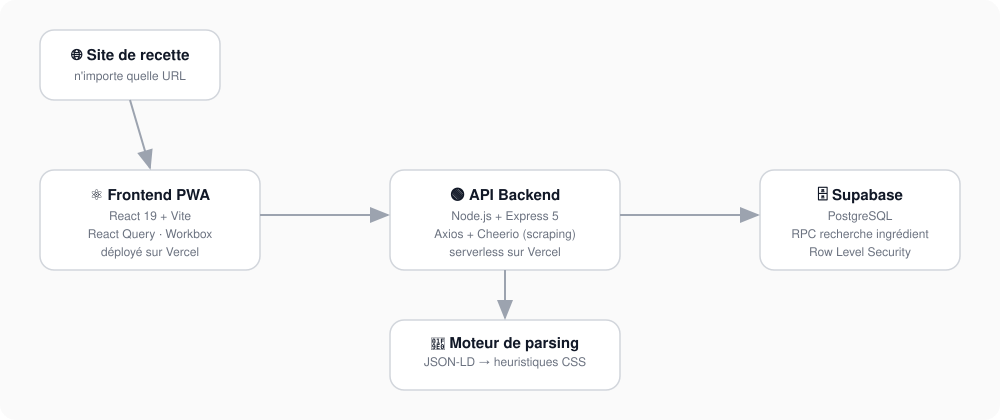

> [!NOTE]
> Projet personnel né d'un problème du quotidien — organiser les repas de la semaine sans y perdre une heure. C'était aussi l'occasion de me former aux Progressive Web Apps et d'expérimenter Claude Code sur un vrai projet, du premier commit au déploiement.

<br/>

<div align="center">

<br/>

<picture>
  <source media="(prefers-color-scheme: dark)" srcset="screenshots/title-dark.png">
  
</picture>

<br/>


<br/><br/>

**[View live demo](https://meal-organizer-front-demo.vercel.app/)**

<br/>

</div>

---

<br/>

> Copier-coller une recette à la main, encore aujourd'hui ? Meal Organizer lit la page à ta place, range la recette au bon endroit, repère ce qui est de saison, et te souffle quoi cuisiner avant même que tu aies ouvert le frigo. Il ne reste plus qu'à décider qui fait la vaisselle.

<br/>

## Fonctionnalités

| | |
|---|---|
| **Import automatique par URL** | Colle un lien depuis n'importe quel site. Priorité au format structuré `schema.org`/JSON-LD, repli sur heuristiques CSS et mots-clés en français. Détection des doublons, confirmation en cas de champs manquants. |
| **Catégorisation automatique** | Un moteur de mots-clés assigne une catégorie à chaque recette selon son titre et ses ingrédients. |
| **Saisonnalité automatique** | Les ingrédients sont croisés avec un calendrier français des produits de saison pour tagger les mois pertinents. |
| **Bibliothèque de recettes** | Scroll infini, recherche texte, filtres croisés (catégorie, ingrédient, mois, temps de préparation), tri multiple. |
| **Suggestions intelligentes** | Saisonnalité, popularité réelle déduite de l'historique, pénalité de diversité anti-répétition, exclusion des suggestions déjà faites la semaine précédente. |
| **Planning hebdomadaire** | Vue calendrier déjeuner/dîner sur sept jours. Recette existante ou note libre par case, auto-complétion `@recette`. |
| **Progressive Web App** | Installable sur mobile et desktop. Web Share Target pour importer une recette depuis n'importe quelle application. Cache hors-ligne via Workbox. |
| **Catégories** | Gestion complète (création, modification, suppression), couleur et mots-clés associés, compteur de recettes. |

<br/>

## Stack technique

<table>
<tr>
<th align="left">Frontend</th>
<th align="left">Backend</th>
</tr>
<tr>
<td valign="top">

- React 19
- Vite
- Tailwind CSS 4
- TanStack React Query
- React Router 7
- Radix UI
- `vite-plugin-pwa`

</td>
<td valign="top">

- Node.js, Express 5
- Supabase (PostgreSQL + RPC)
- Axios, Cheerio (scraping)
- Parsing `schema.org` / JSON-LD
- Déploiement serverless (Vercel)

</td>
</tr>
</table>

<br/>

## Architecture



Le projet est réparti sur deux dépôts, déployés indépendamment sur Vercel :

```
meal-organizer-front/   React + Vite
meal-organizer-back/    Express, fonctions serverless
```

La démo en ligne exécute exactement le même code, connectée à une instance Supabase distincte contenant des données fictives. Aucune donnée personnelle n'y est exposée.

<br/>

## Installation locale

```bash
git clone https://github.com/AntoineGallou31/meal-organizer-front.git
cd meal-organizer-front
npm install
```

```env
VITE_SUPABASE_URL=your-project-url
VITE_SUPABASE_ANON_KEY=your-anon-key
VITE_API_URL=http://localhost:3000
```

```bash
npm run dev
```

Le backend ([meal-organizer-back](https://github.com/AntoineGallou31/meal-organizer-back)) doit tourner en parallèle.

<br/>

---

<div align="center">

<br/>

**Antoine Gallou**
[github.com/AntoineGallou31](https://github.com/AntoineGallou31)

<br/>

</div>
